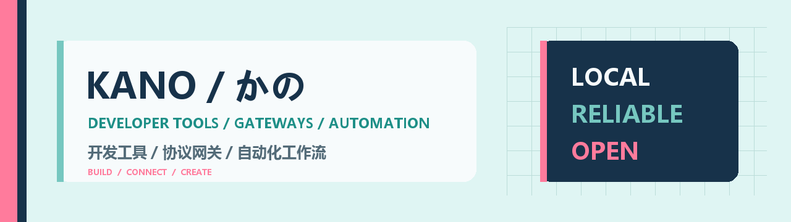

  

## Hi, I'm KANO / 你好，我是 KANO

I build practical AI gateways and agent tools, then give them a little anime soul.

我专注于实用的 AI 网关与 Agent 工具，也喜欢为它们加入一点二次元灵魂。

### Stack / 技术栈

  
  
  
  

## Featured work / 精选项目

<table>
  <tr>
    <td colspan="2">
      <h3><a href="https://github.com/KanoNoUta/thief-neko">Thief Neko</a></h3>
      
A local Catpaw gateway and desktop controller that connects Claude Code and Codex to GLM models.

      
连接 Claude Code、Codex 与 GLM 模型的本地 Catpaw 网关及桌面控制器。

    </td>
  </tr>
  <tr>
    <td width="50%">
      <h3><a href="https://github.com/KanoNoUta/Gensokyo">Gensokyo</a></h3>
      
An anime-inspired theme full of Gensokyo.

      
一款充满幻想乡气息的二次元主题。

    </td>
    <td width="50%">
      <h3><a href="https://github.com/KanoNoUta/kanonouta-blog">Kano no Uta Blog</a></h3>
      
Development notes, experiments, and things worth remembering.

      
记录开发、实验与值得留下的片段。

    </td>
  </tr>
</table>

## Current focus / 当前方向

`Protocol adapters` · `Agent tool loops` · `Local AI workflows`

Building reliable protocol adapters and tool loops for coding agents.

正在打磨更可靠的协议适配、工具调用循环与本地 AI 工作流。

  Code with utility. Design with personality. 让工具真正有用，也让它保留一点自己的性格。

