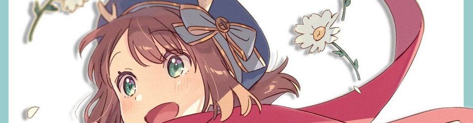

  

I build practical developer tools and protocol gateways with a focus on reliable local workflows.

### Languages & Tools

  
  
  
  

## Featured Work

<table>
  <tr>
    <td colspan="2">
      <h3><a href="https://github.com/KanoNoUta/thief-neko">Thief Neko</a></h3>
      
A local protocol gateway and desktop controller for connecting development clients to custom services.

    </td>
  </tr>
  <tr>
    <td width="50%">
      <h3><a href="https://github.com/PromeRotation/WebTimeline">WebTimeline</a></h3>
      
A visual editor for PromeRotation ACR timelines.

    </td>
    <td width="50%">
      <h3><a href="https://github.com/KanoNoUta/kanonouta-blog">Kano no Uta Blog</a></h3>
      
Development notes, experiments, and things worth remembering.

    </td>
  </tr>
</table>

## Current Focus

`Protocol adapters` · `Tool integrations` · `Local workflows`

Building reliable protocol adapters and tool integrations for developer workflows.

  今、思い出に僕は都落ち

