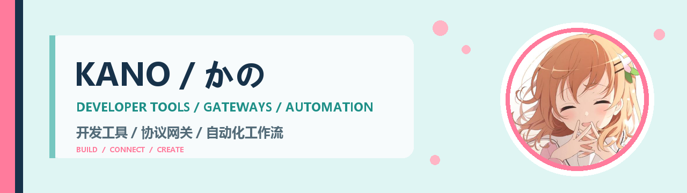

  

## Hi, I'm KANO / 你好，我是 KANO

I build practical developer tools and protocol gateways with a focus on reliable local workflows.

我专注于实用的开发工具与协议网关，并持续打磨可靠的本地工作流。

### Stack / 技术栈

  
  
  
  

## Featured work / 精选项目

<table>
  <tr>
    <td colspan="2">
      <h3><a href="https://github.com/KanoNoUta/thief-neko">Thief Neko</a></h3>
      
A local protocol gateway and desktop controller for connecting development clients to custom services.

      
用于连接开发客户端与自定义服务的本地协议网关和桌面控制器。

    </td>
  </tr>
  <tr>
    <td width="50%">
      <h3><a href="https://github.com/KanoNoUta/Gensokyo">Gensokyo</a></h3>
      
A theme inspired by Gensokyo.

      
一款以幻想乡为灵感的主题。

    </td>
    <td width="50%">
      <h3><a href="https://github.com/KanoNoUta/kanonouta-blog">Kano no Uta Blog</a></h3>
      
Development notes, experiments, and things worth remembering.

      
记录开发、实验与值得留下的片段。

    </td>
  </tr>
</table>

## Current focus / 当前方向

`Protocol adapters` · `Tool integrations` · `Local workflows`

Building reliable protocol adapters and tool integrations for developer workflows.

正在打磨更可靠的协议适配、工具集成与本地开发工作流。

  Code with utility. Design with personality. 让工具真正有用，也让设计保留自己的性格。

